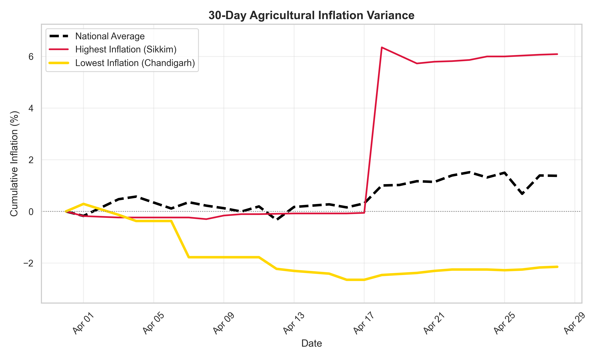
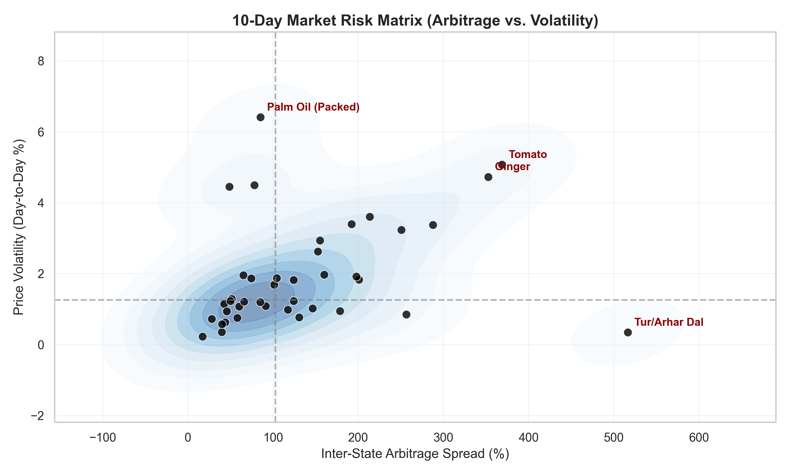

#  Agri-Price Intelligence Dashboard
> **Status:** Operational | **Data Snapshot:** April 28, 2026

This automated engine tracks wholesale prices across India and uses Machine Learning to forecast short-term price momentum.

> **National Average Inflation:** 30-Day: +1.38% | 7-Day: +0.24% | 24-Hour: -0.01%

##  Price Momentum & Forecasts
| S.No | Commodity | 1-Month Trend | 1-Week Trend | Price Difference | Tomorrow (Forecast) |
|---|---|---|---|---|---|
| 1 | **Atta (Wheat)** | +0.15% | -0.66% | ₹34.15 | -₹0.43 |
| 2 | **Bajra (whole)** | -3.85% | +1.61% | ₹49.77 | -₹0.87 |
| 3 | **Banana** | -1.08% | -2.05% | ₹56.17 | -₹0.36 |
| 4 | **Besan** | +0.03% | -0.60% | ₹44.75 | -₹0.77 |
| 5 | **Black Pepper (whole)** | -0.36% | -0.16% | ₹32.40 | +₹0.00 |
| 6 | **Brinjal** | +2.11% | +0.56% | ₹64.87 | -₹0.06 |
| 7 | **Butter (Pasteurised)** | -0.82% | -0.14% | ₹8.90 | +₹0.03 |
| 8 | **Coriander (whole)** | +0.10% | +1.53% | ₹44.86 | -₹0.47 |
| 9 | **Cummin Seed (whole)** | -1.28% | +0.06% | ₹48.64 | -₹0.54 |
| 10 | **Desi Ghee** | +0.43% | -0.75% | ₹196.09 | -₹0.18 |
| 11 | **Eggs** | +0.82% | +1.43% | ₹40.64 | -₹0.06 |
| 12 | **Garlic** | -1.78% | +0.06% | ₹53.03 | -₹0.25 |
| 13 | **Ginger** | +0.82% | +0.01% | ₹65.67 | -₹0.19 |
| 14 | **Gram Dal** | -0.65% | +0.16% | ₹55.29 | -₹0.23 |
| 15 | **Groundnut Oil (Packed)** | +11.74% | -0.28% | ₹132.00 | +₹6.39 |
| 16 | **Gur** | +0.41% | +0.51% | ₹62.81 | -₹0.29 |
| 17 | **Jowar (whole)** | +0.77% | +0.73% | ₹38.35 | -₹0.44 |
| 18 | **Maida (wheat)** | +0.11% | +0.31% | ₹27.27 | -₹0.23 |
| 19 | **Masoor Dal** | -0.23% | -0.01% | ₹43.16 | -₹0.41 |
| 20 | **Milk @** | -0.25% | +0.79% | ₹36.69 | -₹0.49 |
| 21 | **Moong Dal** | +0.28% | -0.16% | ₹39.50 | -₹0.44 |
| 22 | **Mustard Oil (Packed)** | +0.45% | +0.13% | ₹78.36 | +₹2.50 |
| 23 | **Onion** | -2.94% | +0.08% | ₹30.17 | -₹0.33 |
| 24 | **Palm Oil (Packed)** | +12.57% | +0.89% | ₹97.00 | -₹5.81 |
| 25 | **Potato** | -2.73% | -0.46% | ₹35.00 | -₹0.25 |
| 26 | **Ragi (whole)** | +6.27% | +0.07% | ₹71.22 | -₹0.05 |
| 27 | **Red Chillies (whole)** | -0.69% | -0.15% | ₹26.18 | -₹0.12 |
| 28 | **Rice** | -0.66% | +0.33% | ₹20.30 | -₹0.03 |
| 29 | **Salt Pack (Iodised)** | -0.27% | -0.13% | ₹19.40 | +₹0.10 |
| 30 | **Soya Oil (Packed)** | +6.18% | +1.14% | ₹52.09 | -₹1.12 |
| 31 | **Sugar** | -0.46% | +0.29% | ₹12.33 | -₹0.10 |
| 32 | **Suji (whole)** | +0.94% | -0.19% | ₹44.42 | -₹0.83 |
| 33 | **Sunflower Oil (Packed)** | +1.44% | +0.61% | ₹483.86 | -₹0.78 |
| 34 | **Tea Loose** | +0.18% | -1.81% | ₹437.50 | -₹2.78 |
| 35 | **Tomato** | +16.29% | +8.40% | ₹67.70 | +₹0.08 |
| 36 | **Tur/Arhar Dal** | -0.22% | -0.45% | ₹136.50 | -₹0.26 |
| 37 | **Turmeric (powder)** | -0.21% | +0.16% | ₹15.45 | +₹0.01 |
| 38 | **Urad Dal** | +0.46% | +0.19% | ₹44.10 | -₹0.31 |
| 39 | **Vanaspati (Packed)** | +1.39% | +0.21% | ₹69.26 | -₹2.15 |
| 40 | **Wheat** | +0.25% | -0.79% | ₹21.52 | -₹0.28 |

##  Visual Trends

### 30-Day Inflation Variance (National vs Extremes)
*The graph below represents the average cumulative inflation across India, compared against the specific State or Union Territory experiencing the highest and lowest price variations over the last 30 days.*

### 10-Day Market Risk Matrix (Arbitrage vs. Volatility)
**How to read this matrix:**
* ↘️ **Bottom-Right (Golden Zone):** High profit margins, stable prices.
* ↗️ **Top-Right (High Risk):** Huge profit margins, but prices change violently.
* ↖️ **Top-Left (Chaos Zone):** Low profit margins and highly unstable prices.
* ↙️ **Bottom-Left (Safe Zone):** Low profit margins, but very predictable staple prices.

<b>  Click to View: Daily State-by-State Highs & Lows</b>

| S.No | Commodity | Highest Price | Lowest Price | Today (Predicted) | Average |
|---|---|---|---|---|---|
| 1 | **Atta (Wheat)** | ₹67.00 (Andaman an) | ₹32.85 (Uttar Prad) | **₹41.51** | ₹42.12 |
| 2 | **Bajra (whole)** | ₹79.11 (Meghalaya) | ₹29.34 (Rajasthan) | **₹44.59** | ₹45.97 |
| 3 | **Banana** | ₹92.50 (Ladakh) | ₹36.33 (DNH and DD) | **₹52.72** | ₹53.46 |
| 4 | **Besan** | ₹132.00 (Andaman an) | ₹87.25 (Manipur) | **₹97.80** | ₹98.89 |
| 5 | **Black Pepper (whole)** | ₹110.00 (DNH and DD) | ₹77.60 (Gujarat) | **₹90.12** | ₹90.24 |
| 6 | **Brinjal** | ₹95.00 (Andaman an) | ₹30.13 (Madhya Pra) | **₹46.76** | ₹47.28 |
| 7 | **Butter (Pasteurised)** | ₹64.50 (Tamil Nadu) | ₹55.60 (Gujarat) | **₹59.21** | ₹59.19 |
| 8 | **Coriander (whole)** | ₹75.86 (Mizoram) | ₹31.00 (Gujarat) | **₹42.06** | ₹42.84 |
| 9 | **Cummin Seed (whole)** | ₹78.64 (Mizoram) | ₹30.00 (Delhi) | **₹43.04** | ₹43.91 |
| 10 | **Desi Ghee** | ₹808.00 (Andaman an) | ₹611.91 (Telangana) | **₹690.62** | ₹689.71 |
| 11 | **Eggs** | ₹108.00 (Andaman an) | ₹67.36 (Telangana) | **₹80.17** | ₹80.70 |
| 12 | **Garlic** | ₹79.33 (Andaman an) | ₹26.30 (Gujarat) | **₹40.46** | ₹41.14 |
| 13 | **Ginger** | ₹81.67 (Andaman an) | ₹16.00 (Manipur) | **₹27.99** | ₹28.61 |
| 14 | **Gram Dal** | ₹133.50 (Ladakh) | ₹78.21 (Bihar) | **₹89.15** | ₹89.92 |
| 15 | **Groundnut Oil (Packed)** | ₹284.00 (Andaman an) | ₹152.00 (Meghalaya) | **₹211.89** | ₹203.42 |
| 16 | **Gur** | ₹111.18 (Mizoram) | ₹48.37 (Rajasthan) | **₹62.46** | ₹62.92 |
| 17 | **Jowar (whole)** | ₹75.00 (Tripura) | ₹36.65 (Rajasthan) | **₹47.32** | ₹48.13 |
| 18 | **Maida (wheat)** | ₹63.33 (Andaman an) | ₹36.06 (Bihar) | **₹43.59** | ₹44.18 |
| 19 | **Masoor Dal** | ₹121.40 (Tripura) | ₹78.24 (Bihar) | **₹93.03** | ₹93.76 |
| 20 | **Milk @** | ₹80.55 (Mizoram) | ₹43.86 (Tamil Nadu) | **₹62.58** | ₹63.04 |
| 21 | **Moong Dal** | ₹136.50 (Mizoram) | ₹97.00 (Tripura) | **₹114.66** | ₹115.25 |
| 22 | **Mustard Oil (Packed)** | ₹241.80 (Mizoram) | ₹163.44 (Nagaland) | **₹201.86** | ₹196.56 |
| 23 | **Onion** | ₹50.00 (Andaman an) | ₹19.83 (Madhya Pra) | **₹28.21** | ₹28.75 |
| 24 | **Palm Oil (Packed)** | ₹201.00 (Ladakh) | ₹104.00 (Himachal P) | **₹135.93** | ₹145.74 |
| 25 | **Potato** | ₹45.00 (Ladakh) | ₹10.00 (Chandigarh) | **₹22.61** | ₹22.95 |
| 26 | **Ragi (whole)** | ₹100.00 (Mizoram) | ₹28.78 (Meghalaya) | **₹56.34** | ₹56.38 |
| 27 | **Red Chillies (whole)** | ₹47.27 (Mizoram) | ₹21.09 (Andhra Pra) | **₹30.52** | ₹30.51 |
| 28 | **Rice** | ₹55.50 (Goa) | ₹35.20 (Gujarat) | **₹44.17** | ₹44.24 |
| 29 | **Salt Pack (Iodised)** | ₹30.00 (Mizoram) | ₹10.60 (Tripura) | **₹23.14** | ₹22.91 |
| 30 | **Soya Oil (Packed)** | ₹196.00 (Delhi) | ₹143.91 (Mizoram) | **₹161.93** | ₹164.03 |
| 31 | **Sugar** | ₹56.33 (Andaman an) | ₹44.00 (Gujarat) | **₹47.71** | ₹47.94 |
| 32 | **Suji (whole)** | ₹81.67 (Andaman an) | ₹37.25 (Himachal P) | **₹49.13** | ₹50.31 |
| 33 | **Sunflower Oil (Packed)** | ₹645.00 (Ladakh) | ₹161.14 (Rajasthan) | **₹196.93** | ₹199.89 |
| 34 | **Tea Loose** | ₹645.00 (Ladakh) | ₹207.50 (Gujarat) | **₹294.36** | ₹298.08 |
| 35 | **Tomato** | ₹88.45 (Mizoram) | ₹20.75 (Chhattisga) | **₹40.12** | ₹40.74 |
| 36 | **Tur/Arhar Dal** | ₹158.50 (Ladakh) | ₹22.00 (Sikkim) | **₹124.89** | ₹124.90 |
| 37 | **Turmeric (powder)** | ₹29.45 (Mizoram) | ₹14.00 (Delhi) | **₹17.09** | ₹17.09 |
| 38 | **Urad Dal** | ₹146.67 (Sikkim) | ₹102.57 (Assam) | **₹122.20** | ₹123.14 |
| 39 | **Vanaspati (Packed)** | ₹210.50 (Goa) | ₹141.24 (Andhra Pra) | **₹167.18** | ₹169.49 |
| 40 | **Wheat** | ₹48.00 (Goa) | ₹26.48 (Uttar Prad) | **₹36.61** | ₹36.96 |

---
*Generated automatically by AgriPulse Engine on GitHub Actions.*
