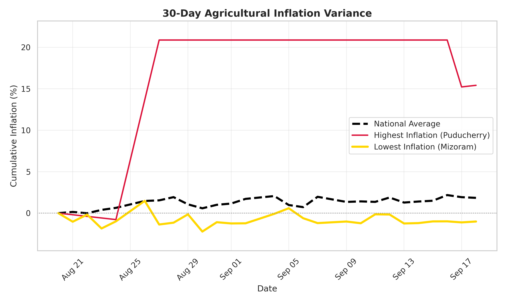
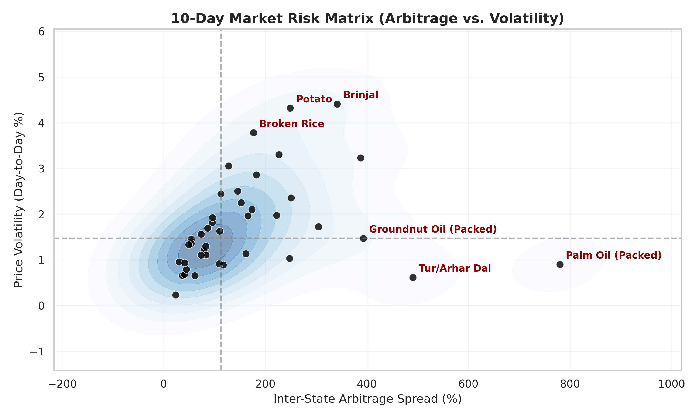

#  Agri-Price daily smart Dashboard
> **Status:** Operational | **Data Snapshot:** May 30, 2026

This automated engine tracks wholesale prices across India and uses Machine Learning to forecast short-term price momentum.

> **National Average Inflation:** 30-Day: +0.82% | 7-Day: +0.30% | 24-Hour: +0.04%

##  Price Momentum & Forecasts
| S.No | Commodity | 1-Month Trend | 1-Week Trend | Price Difference | Tomorrow (Forecast) |
|---|---|---|---|---|---|
| 1 | **Atta (Wheat)** | -0.62% | +0.92% | ₹34.04 | -₹0.21 |
| 2 | **Bajra (whole)** | -0.91% | +2.80% | ₹52.77 | -₹0.69 |
| 3 | **Banana** | +3.37% | +0.66% | ₹53.52 | -₹0.77 |
| 4 | **Besan** | +1.81% | +0.16% | ₹46.47 | -₹0.60 |
| 5 | **Black Pepper (whole)** | +0.47% | +0.27% | ₹35.75 | -₹0.32 |
| 6 | **Brinjal** | +8.89% | +1.26% | ₹99.86 | -₹0.80 |
| 7 | **Butter (Pasteurised)** | +0.48% | -0.07% | ₹9.26 | +₹0.09 |
| 8 | **Coriander (whole)** | +3.34% | +0.80% | ₹43.42 | -₹0.18 |
| 9 | **Cummin Seed (whole)** | +0.40% | +1.29% | ₹46.43 | -₹0.30 |
| 10 | **Desi Ghee** | +1.33% | +0.06% | ₹200.83 | +₹0.47 |
| 11 | **Eggs** | +1.52% | +0.15% | ₹39.91 | -₹0.13 |
| 12 | **Garlic** | +4.11% | +0.68% | ₹59.42 | -₹0.50 |
| 13 | **Ginger** | +7.84% | +2.38% | ₹68.67 | -₹0.90 |
| 14 | **Gram Dal** | +1.54% | +0.42% | ₹54.85 | -₹0.63 |
| 15 | **Groundnut Oil (Packed)** | +2.30% | -0.42% | ₹226.25 | +₹2.84 |
| 16 | **Gur** | +1.18% | +0.61% | ₹62.49 | -₹0.13 |
| 17 | **Jowar (whole)** | +4.84% | +1.85% | ₹29.00 | -₹0.75 |
| 18 | **Maida (wheat)** | +1.90% | +0.19% | ₹27.89 | -₹0.70 |
| 19 | **Masoor Dal** | +0.70% | +0.40% | ₹55.40 | -₹0.65 |
| 20 | **Milk @** | +1.03% | -0.15% | ₹37.82 | +₹0.09 |
| 21 | **Moong Dal** | +0.86% | +0.21% | ₹47.54 | -₹0.54 |
| 22 | **Mustard Oil (Packed)** | +1.35% | +0.31% | ₹86.53 | -₹0.96 |
| 23 | **Onion** | +4.75% | +0.83% | ₹30.21 | -₹0.35 |
| 24 | **Palm Oil (Packed)** | +2.66% | +0.99% | ₹148.67 | +₹1.44 |
| 25 | **Potato** | +7.76% | +1.45% | ₹35.00 | -₹0.22 |
| 26 | **Ragi (whole)** | +2.29% | -0.11% | ₹72.57 | +₹0.12 |
| 27 | **Red Chillies (whole)** | +1.68% | +0.55% | ₹28.48 | -₹0.13 |
| 28 | **Rice** | +1.77% | +0.62% | ₹19.83 | -₹0.06 |
| 29 | **Salt Pack (Iodised)** | -0.82% | -0.45% | ₹18.40 | +₹0.13 |
| 30 | **Soya Oil (Packed)** | +0.68% | +0.01% | ₹150.46 | +₹2.16 |
| 31 | **Sugar** | +1.65% | +0.65% | ₹11.42 | -₹0.24 |
| 32 | **Suji (whole)** | +3.80% | +0.24% | ₹45.42 | -₹0.46 |
| 33 | **Sunflower Oil (Packed)** | +0.14% | +0.61% | ₹481.25 | -₹3.70 |
| 34 | **Tea Loose** | +0.75% | +1.70% | ₹436.08 | -₹2.85 |
| 35 | **Tomato** | +7.48% | +0.86% | ₹76.23 | -₹1.41 |
| 36 | **Tur/Arhar Dal** | +0.80% | +0.31% | ₹136.50 | -₹0.98 |
| 37 | **Turmeric (powder)** | +0.53% | +0.46% | ₹18.14 | +₹0.05 |
| 38 | **Urad Dal** | +1.26% | +0.35% | ₹43.72 | -₹0.79 |
| 39 | **Vanaspati (Packed)** | +9.43% | +0.39% | ₹66.95 | +₹0.07 |
| 40 | **Wheat** | +2.63% | +0.56% | ₹19.90 | +₹0.04 |

##  Visual Trends

### 30-Day Inflation Variance (National vs Extremes)
*The graph below represents the average cumulative inflation across India, compared against the specific State or Union Territory experiencing the highest and lowest price variations over the last 30 days.*

### 10-Day Market Risk Matrix (Arbitrage vs. Volatility)
**How to read this matrix:**

* **Bottom-Right Quadrant (Golden Zone):** High profit margins, stable prices.
* **Top-Right Quadrant (High Risk):** Huge profit margins, but prices change violently.
* **Top-Left Quadrant (Chaos Zone):** Low profit margins and highly unstable prices.
* **Bottom-Left Quadrant (Safe Zone):** Low profit margins, but very predictable staple prices.

<b>  Click to View: Daily State-by-State Highs & Lows</b>

| S.No | Commodity | Highest Price | Lowest Price | Today (Predicted) | Average |
|---|---|---|---|---|---|
| 1 | **Atta (Wheat)** | ₹67.00 (Andaman an) | ₹32.96 (Uttar Prad) | **₹41.46** | ₹42.00 |
| 2 | **Bajra (whole)** | ₹83.57 (Meghalaya) | ₹30.80 (Rajasthan) | **₹45.35** | ₹46.67 |
| 3 | **Banana** | ₹92.50 (Ladakh) | ₹38.98 (Madhya Pra) | **₹53.67** | ₹54.92 |
| 4 | **Besan** | ₹129.67 (Andaman an) | ₹83.20 (Tripura) | **₹96.94** | ₹98.01 |
| 5 | **Black Pepper (whole)** | ₹114.00 (DNH and DD) | ₹78.25 (Gujarat) | **₹90.51** | ₹91.10 |
| 6 | **Brinjal** | ₹130.00 (Andaman an) | ₹30.14 (Madhya Pra) | **₹46.42** | ₹47.94 |
| 7 | **Butter (Pasteurised)** | ₹64.68 (Tamil Nadu) | ₹55.42 (Gujarat) | **₹59.40** | ₹59.30 |
| 8 | **Coriander (whole)** | ₹74.50 (Mizoram) | ₹31.08 (Gujarat) | **₹43.35** | ₹43.61 |
| 9 | **Cummin Seed (whole)** | ₹76.43 (Mizoram) | ₹30.00 (Delhi) | **₹43.48** | ₹43.98 |
| 10 | **Desi Ghee** | ₹810.33 (Andaman an) | ₹609.50 (Rajasthan) | **₹690.46** | ₹691.70 |
| 11 | **Eggs** | ₹108.00 (Andaman an) | ₹68.09 (Telangana) | **₹81.06** | ₹81.26 |
| 12 | **Garlic** | ₹86.00 (Andaman an) | ₹26.58 (Gujarat) | **₹41.30** | ₹41.99 |
| 13 | **Ginger** | ₹86.67 (Andaman an) | ₹18.00 (Manipur) | **₹30.25** | ₹31.63 |
| 14 | **Gram Dal** | ₹133.50 (Ladakh) | ₹78.65 (Bihar) | **₹88.80** | ₹89.96 |
| 15 | **Groundnut Oil (Packed)** | ₹284.00 (Andaman an) | ₹57.75 (Jammu and ) | **₹190.78** | ₹186.88 |
| 16 | **Gur** | ₹109.29 (Mizoram) | ₹46.80 (Rajasthan) | **₹63.00** | ₹63.50 |
| 17 | **Jowar (whole)** | ₹63.00 (Manipur) | ₹34.00 (Chhattisga) | **₹45.61** | ₹46.93 |
| 18 | **Maida (wheat)** | ₹64.00 (Andaman an) | ₹36.11 (Bihar) | **₹43.09** | ₹44.22 |
| 19 | **Masoor Dal** | ₹134.40 (Tripura) | ₹79.00 (Bihar) | **₹92.73** | ₹93.92 |
| 20 | **Milk @** | ₹81.43 (Mizoram) | ₹43.61 (Tamil Nadu) | **₹63.75** | ₹63.72 |
| 21 | **Moong Dal** | ₹139.14 (Mizoram) | ₹91.60 (Tripura) | **₹114.07** | ₹114.88 |
| 22 | **Mustard Oil (Packed)** | ₹244.86 (Mizoram) | ₹158.33 (Nagaland) | **₹194.83** | ₹196.58 |
| 23 | **Onion** | ₹50.00 (Andaman an) | ₹19.79 (Madhya Pra) | **₹28.89** | ₹29.54 |
| 24 | **Palm Oil (Packed)** | ₹172.00 (Delhi) | ₹23.33 (Sikkim) | **₹135.74** | ₹134.37 |
| 25 | **Potato** | ₹45.00 (Ladakh) | ₹10.00 (Chandigarh) | **₹22.93** | ₹23.55 |
| 26 | **Ragi (whole)** | ₹100.00 (Mizoram) | ₹27.43 (Meghalaya) | **₹54.73** | ₹54.32 |
| 27 | **Red Chillies (whole)** | ₹50.57 (Mizoram) | ₹22.09 (Andhra Pra) | **₹31.05** | ₹31.25 |
| 28 | **Rice** | ₹55.00 (Andaman an) | ₹35.17 (Gujarat) | **₹43.78** | ₹44.04 |
| 29 | **Salt Pack (Iodised)** | ₹30.00 (Jammu and ) | ₹11.60 (Tripura) | **₹23.16** | ₹22.90 |
| 30 | **Soya Oil (Packed)** | ₹196.00 (Delhi) | ₹45.54 (Tamil Nadu) | **₹159.37** | ₹156.53 |
| 31 | **Sugar** | ₹55.67 (Andaman an) | ₹44.25 (Gujarat) | **₹48.02** | ₹48.43 |
| 32 | **Suji (whole)** | ₹82.67 (Andaman an) | ₹37.25 (Himachal P) | **₹49.39** | ₹50.25 |
| 33 | **Sunflower Oil (Packed)** | ₹645.00 (Ladakh) | ₹163.75 (Chhattisga) | **₹196.48** | ₹202.23 |
| 34 | **Tea Loose** | ₹645.00 (Ladakh) | ₹208.92 (Gujarat) | **₹291.04** | ₹297.27 |
| 35 | **Tomato** | ₹100.00 (Andaman an) | ₹23.77 (Punjab) | **₹41.98** | ₹44.09 |
| 36 | **Tur/Arhar Dal** | ₹158.50 (Ladakh) | ₹22.00 (Sikkim) | **₹123.56** | ₹125.47 |
| 37 | **Turmeric (powder)** | ₹32.14 (Mizoram) | ₹14.00 (Delhi) | **₹17.33** | ₹17.30 |
| 38 | **Urad Dal** | ₹147.33 (Sikkim) | ₹103.61 (Assam) | **₹122.23** | ₹123.60 |
| 39 | **Vanaspati (Packed)** | ₹209.00 (Andaman an) | ₹142.05 (Andhra Pra) | **₹169.40** | ₹169.65 |
| 40 | **Wheat** | ₹46.50 (Kerala) | ₹26.60 (Uttar Prad) | **₹36.47** | ₹36.60 |

---
*Generated automatically by AgriPulse Engine on GitHub Actions.*
