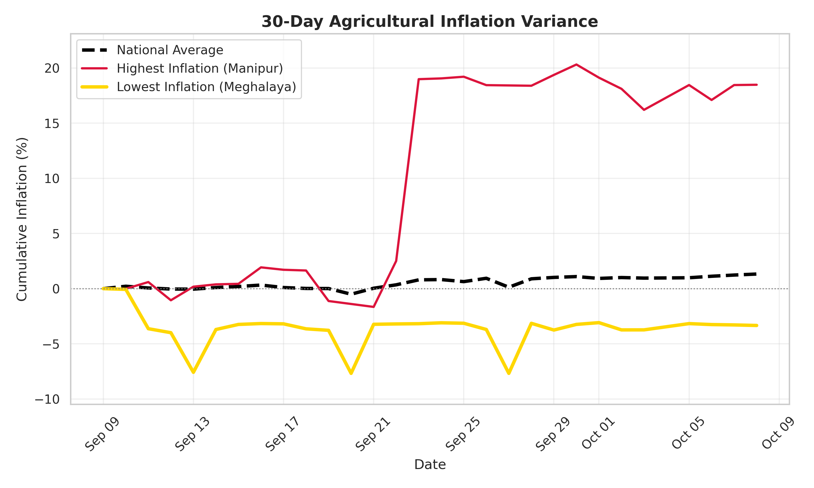
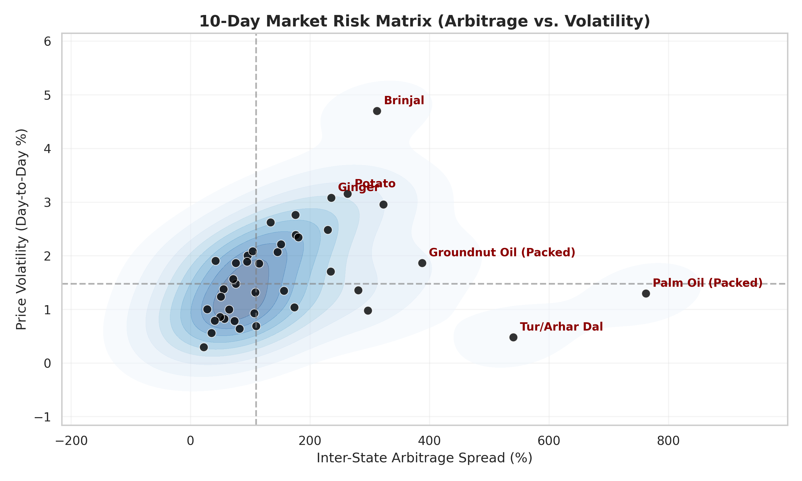

#  Agri-Price daily smart Dashboard
> **Status:** Operational | **Data Snapshot:** October 05, 2026

This automated engine tracks wholesale prices across India and uses Machine Learning to forecast short-term price momentum.

> **National Average Inflation:** 30-Day: +1.89% | 7-Day: +0.74% | 24-Hour: -0.01%

##  Price Momentum & Forecasts
| S.No | Commodity | 1-Month Trend | 1-Week Trend | Price Difference | Tomorrow (Forecast) |
|---|---|---|---|---|---|
| 1 | **Atta (Wheat)** | +7.63% | +0.51% | ₹34.15 | -₹0.29 |
| 2 | **Bajra (whole)** | +5.95% | -1.17% | ₹60.00 | -₹0.05 |
| 3 | **Banana** | +5.39% | -0.53% | ₹52.87 | +₹0.18 |
| 4 | **Besan** | +5.79% | +0.98% | ₹67.67 | -₹0.10 |
| 5 | **Black Pepper (whole)** | +1.94% | +0.35% | ₹25.66 | -₹0.07 |
| 6 | **Brinjal** | +16.34% | -1.18% | ₹123.71 | -₹0.79 |
| 7 | **Broken Rice** | +10.25% | -0.80% | ₹45.52 | -₹0.01 |
| 8 | **Butter (Pasteurised)** | +0.82% | -0.35% | ₹13.08 | -₹0.05 |
| 9 | **Coriander (whole)** | +1.14% | -3.19% | ₹51.07 | +₹0.31 |
| 10 | **Cummin Seed (whole)** | +6.78% | -1.78% | ₹46.91 | +₹0.40 |
| 11 | **Desi Ghee** | +1.76% | +0.48% | ₹281.00 | -₹4.22 |
| 12 | **Eggs** | +2.20% | -1.12% | ₹43.83 | +₹0.25 |
| 13 | **Garlic** | +7.03% | -0.60% | ₹61.68 | -₹0.71 |
| 14 | **Ginger** | +1.06% | -2.98% | ₹65.67 | -₹0.26 |
| 15 | **Gram Dal** | +6.14% | +1.01% | ₹57.00 | +₹0.06 |
| 16 | **Groundnut Oil (Packed)** | -1.64% | +0.65% | ₹223.67 | -₹2.42 |
| 17 | **Gur** | +3.28% | +0.64% | ₹55.01 | -₹0.18 |
| 18 | **Jowar (whole)** | +8.96% | +2.11% | ₹40.00 | -₹0.66 |
| 19 | **Maida (wheat)** | +7.54% | +0.70% | ₹38.86 | -₹0.15 |
| 20 | **Masoor Dal** | +3.39% | +0.60% | ₹50.77 | +₹0.25 |
| 21 | **Milk @** | +1.75% | -0.44% | ₹36.67 | +₹0.04 |
| 22 | **Moong Dal** | +3.48% | +0.22% | ₹29.00 | +₹0.02 |
| 23 | **Mustard Oil (Packed)** | +4.72% | +0.98% | ₹83.40 | -₹0.68 |
| 24 | **Onion** | +10.72% | -1.41% | ₹50.04 | -₹0.29 |
| 25 | **Palm Oil (Packed)** | +4.55% | +0.20% | ₹176.34 | -₹2.13 |
| 26 | **Potato** | +11.13% | +1.17% | ₹38.57 | -₹0.37 |
| 27 | **Ragi (whole)** | +5.76% | -0.97% | ₹72.67 | -₹0.30 |
| 28 | **Red Chillies (whole)** | +4.81% | -1.07% | ₹23.36 | +₹0.06 |
| 29 | **Rice** | +2.28% | +1.03% | ₹27.85 | -₹0.52 |
| 30 | **Salt Pack (Iodised)** | -0.93% | +0.23% | ₹20.07 | -₹0.20 |
| 31 | **Soya Oil (Packed)** | -0.66% | -0.53% | ₹166.32 | +₹2.00 |
| 32 | **Sugar** | -6.21% | -1.66% | ₹21.37 | -₹0.05 |
| 33 | **Suji (whole)** | +8.63% | -0.34% | ₹52.09 | -₹0.29 |
| 34 | **Sunflower Oil (Packed)** | +6.19% | -0.22% | ₹470.50 | +₹3.70 |
| 35 | **Tea Loose** | +8.34% | +1.73% | ₹419.42 | +₹1.38 |
| 36 | **Tomato** | +16.68% | +2.80% | ₹70.45 | +₹0.52 |
| 37 | **Tur/Arhar Dal** | +2.43% | +0.99% | ₹126.63 | -₹0.75 |
| 38 | **Turmeric (powder)** | +4.68% | -0.77% | ₹10.30 | +₹0.06 |
| 39 | **Urad Dal** | +5.86% | +1.08% | ₹42.76 | -₹0.14 |
| 40 | **Vanaspati (Packed)** | +9.26% | +1.12% | ₹73.85 | -₹0.50 |
| 41 | **Wheat** | +2.49% | +0.48% | ₹20.43 | -₹0.38 |

##  Visual Trends

### 30-Day Inflation Variance (National vs Extremes)
*The graph below represents the average cumulative inflation across India, compared against the specific State or Union Territory experiencing the highest and lowest price variations over the last 30 days.*

### 10-Day Market Risk Matrix (Arbitrage vs. Volatility)
**How to read this matrix:**

* **Bottom-Right Quadrant (Golden Zone):** High profit margins, stable prices.
* **Top-Right Quadrant (High Risk):** Huge profit margins, but prices change violently.
* **Top-Left Quadrant (Chaos Zone):** Low profit margins and highly unstable prices.
* **Bottom-Left Quadrant (Safe Zone):** Low profit margins, but very predictable staple prices.

<b>  Click to View: Daily State-by-State Highs & Lows</b>

| S.No | Commodity | Highest Price | Lowest Price | Today (Predicted) | Average |
|---|---|---|---|---|---|
| 1 | **Atta (Wheat)** | ₹68.00 (Andaman an) | ₹33.85 (Punjab) | **₹42.27** | ₹42.80 |
| 2 | **Bajra (whole)** | ₹85.00 (Meghalaya) | ₹25.00 (Haryana) | **₹46.37** | ₹46.46 |
| 3 | **Banana** | ₹90.00 (Ladakh) | ₹37.13 (Madhya Pra) | **₹55.98** | ₹55.89 |
| 4 | **Besan** | ₹146.67 (Andaman an) | ₹79.00 (Manipur) | **₹99.55** | ₹100.22 |
| 5 | **Black Pepper (whole)** | ₹106.33 (DNH and DD) | ₹80.67 (Gujarat) | **₹91.08** | ₹91.42 |
| 6 | **Brinjal** | ₹155.67 (Andaman an) | ₹31.96 (Madhya Pra) | **₹49.23** | ₹50.65 |
| 7 | **Broken Rice** | ₹70.00 (Andaman an) | ₹24.48 (Bihar) | **₹39.79** | ₹40.19 |
| 8 | **Butter (Pasteurised)** | ₹70.00 (Andaman an) | ₹56.92 (Gujarat) | **₹61.00** | ₹61.05 |
| 9 | **Coriander (whole)** | ₹84.57 (Mizoram) | ₹33.50 (Gujarat) | **₹47.76** | ₹47.37 |
| 10 | **Cummin Seed (whole)** | ₹78.91 (Mizoram) | ₹32.00 (Delhi) | **₹43.34** | ₹43.14 |
| 11 | **Desi Ghee** | ₹877.00 (Goa) | ₹596.00 (Haryana) | **₹706.48** | ₹712.40 |
| 12 | **Eggs** | ₹113.33 (Andaman an) | ₹69.50 (Haryana) | **₹85.44** | ₹85.21 |
| 13 | **Garlic** | ₹93.33 (Andaman an) | ₹31.65 (Bihar) | **₹48.08** | ₹49.28 |
| 14 | **Ginger** | ₹90.67 (Andaman an) | ₹25.00 (Sikkim) | **₹37.12** | ₹37.56 |
| 15 | **Gram Dal** | ₹140.00 (Ladakh) | ₹83.00 (Bihar) | **₹93.48** | ₹94.04 |
| 16 | **Groundnut Oil (Packed)** | ₹289.00 (Andaman an) | ₹65.33 (Jammu and ) | **₹194.62** | ₹197.02 |
| 17 | **Gur** | ₹114.64 (Mizoram) | ₹59.63 (Chhattisga) | **₹70.35** | ₹70.66 |
| 18 | **Jowar (whole)** | ₹70.00 (Ladakh) | ₹30.00 (Arunachal ) | **₹47.01** | ₹48.16 |
| 19 | **Maida (wheat)** | ₹75.33 (Andaman an) | ₹36.47 (Bihar) | **₹44.63** | ₹45.04 |
| 20 | **Masoor Dal** | ₹130.80 (Tripura) | ₹80.03 (Bihar) | **₹94.22** | ₹94.20 |
| 21 | **Milk @** | ₹81.64 (Mizoram) | ₹44.97 (Tamil Nadu) | **₹64.59** | ₹64.59 |
| 22 | **Moong Dal** | ₹135.20 (Mizoram) | ₹106.20 (Tripura) | **₹115.95** | ₹116.27 |
| 23 | **Mustard Oil (Packed)** | ₹250.33 (Andaman an) | ₹166.93 (Nagaland) | **₹210.34** | ₹211.97 |
| 24 | **Onion** | ₹95.00 (Andaman an) | ₹44.96 (Madhya Pra) | **₹57.49** | ₹58.02 |
| 25 | **Palm Oil (Packed)** | ₹199.67 (Andaman an) | ₹23.33 (Sikkim) | **₹138.82** | ₹141.27 |
| 26 | **Potato** | ₹51.67 (Andaman an) | ₹13.10 (West Benga) | **₹25.23** | ₹25.93 |
| 27 | **Ragi (whole)** | ₹100.00 (Mizoram) | ₹27.33 (Manipur) | **₹55.87** | ₹56.01 |
| 28 | **Red Chillies (whole)** | ₹47.36 (Mizoram) | ₹24.00 (Puducherry) | **₹32.33** | ₹32.46 |
| 29 | **Rice** | ₹64.75 (Karnataka) | ₹36.90 (Meghalaya) | **₹46.98** | ₹47.77 |
| 30 | **Salt Pack (Iodised)** | ₹31.67 (DNH and DD) | ₹11.60 (Tripura) | **₹23.57** | ₹23.80 |
| 31 | **Soya Oil (Packed)** | ₹220.00 (Ladakh) | ₹53.68 (Tamil Nadu) | **₹165.59** | ₹163.34 |
| 32 | **Sugar** | ₹73.67 (Andaman an) | ₹52.30 (Uttar Prad) | **₹57.42** | ₹57.61 |
| 33 | **Suji (whole)** | ₹90.00 (Andaman an) | ₹37.91 (Himachal P) | **₹50.80** | ₹51.37 |
| 34 | **Sunflower Oil (Packed)** | ₹640.00 (Ladakh) | ₹169.50 (Haryana) | **₹209.80** | ₹207.52 |
| 35 | **Tea Loose** | ₹640.00 (Ladakh) | ₹220.58 (Gujarat) | **₹302.67** | ₹303.86 |
| 36 | **Tomato** | ₹96.45 (Mizoram) | ₹26.00 (Puducherry) | **₹47.59** | ₹47.67 |
| 37 | **Tur/Arhar Dal** | ₹148.13 (Nagaland) | ₹21.50 (Sikkim) | **₹126.75** | ₹127.85 |
| 38 | **Turmeric (powder)** | ₹25.22 (Mizoram) | ₹14.92 (Odisha) | **₹17.44** | ₹17.45 |
| 39 | **Urad Dal** | ₹149.33 (Sikkim) | ₹106.57 (Assam) | **₹128.86** | ₹129.38 |
| 40 | **Vanaspati (Packed)** | ₹222.33 (Andaman an) | ₹148.48 (Andhra Pra) | **₹176.84** | ₹178.54 |
| 41 | **Wheat** | ₹48.50 (Manipur) | ₹28.07 (Uttar Prad) | **₹37.40** | ₹38.01 |

---
*Generated automatically by AgriPulse Engine on GitHub Actions.*
